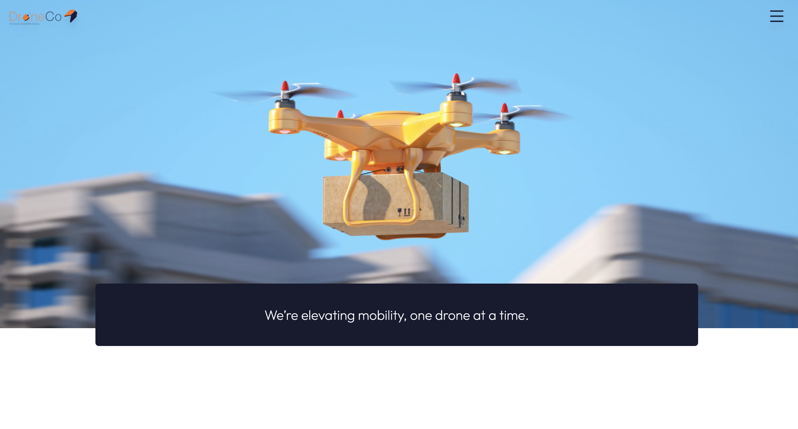
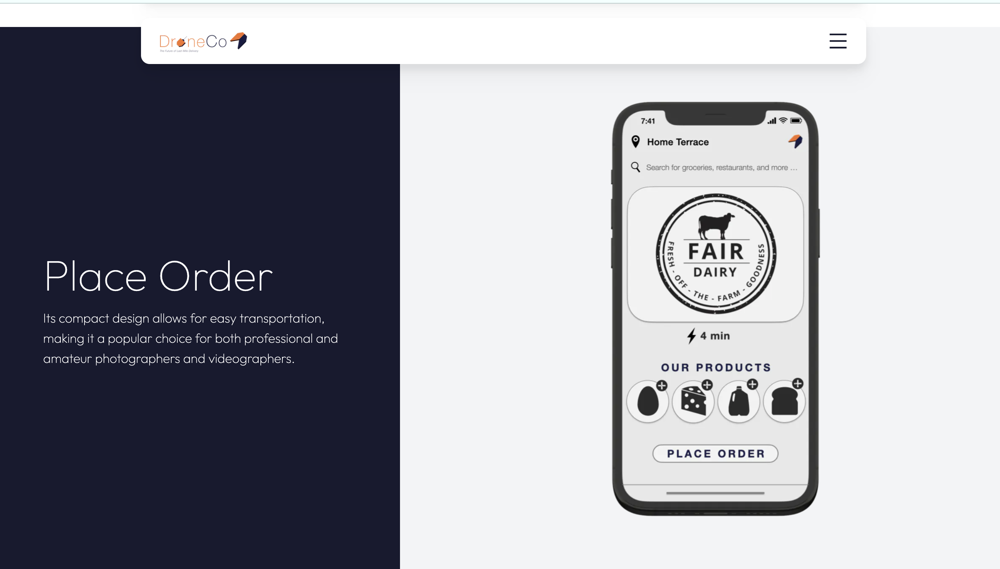

# DroneCo

This is a fronted web applications for a Los Angeles based startup that focuses on creating drones to complete last-mile delivery. This application is solely my own work, from both the design aspect to the implementation of the code, it was created using Next.js, Tailwind.css and Figma was used for the design process

## Demo

Visit the deployed website https://drone-co.vercel.app/

## Project Screenshots




## Libraries

**UI Tools**

```
npm install react-icons --save
npm i react-intersection-observer --save
npm install react-scroll
npm i framer-motion
npm i typewriter-effect
```
